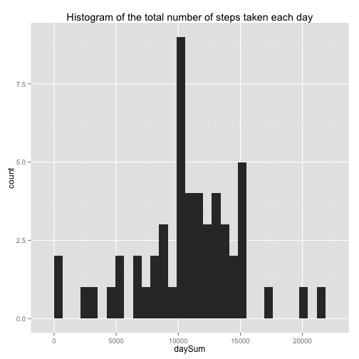
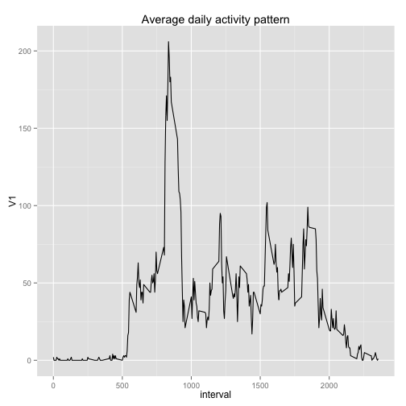
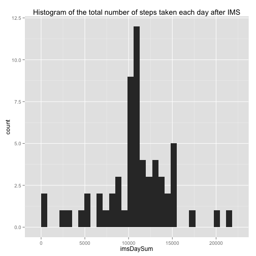
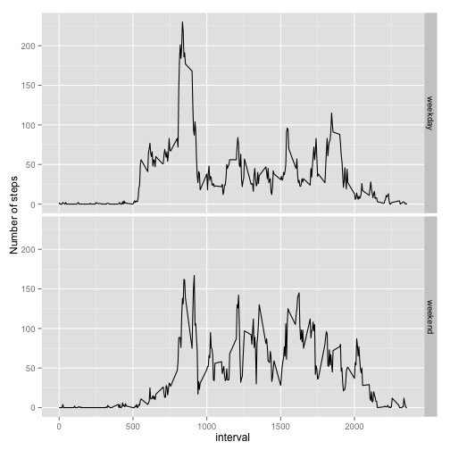

# Reproducible Research: Peer Assessment 1


## Loading and preprocessing the data

```r
data <- read.csv("activity.csv")
data$date <- as.Date(data$date)
```


## What is mean total number of steps taken per day?

```r
ndata <- data[!is.na(data$steps),]
library(ggplot2)
sndata <- split(ndata, ndata$date)
daySum <- sapply(sndata, function(x) sum(x[,1]))
qplot(daySum, main="Histogram of the total number of steps taken each day")
```

```
## stat_bin: binwidth defaulted to range/30. Use 'binwidth = x' to adjust this.
```

 

```r
dayMean <- mean(daySum)
dayMedian <-median(daySum)
```
The mean and median total number of steps taken per day are 1.0766 &times; 10<sup>4</sup>, 10765.


## What is the average daily activity pattern?

```r
library(data.table)
ndata <- data[!is.na(data$steps),]
dapData <- data.table(ndata)
dap <- dapData[, round(mean(steps)), by=interval]
qplot(interval, V1, data=dap, geom="line", main="Average daily activity pattern")
```

 

```r
maxInterval <- dap[V1==max(dap$V1),]$interval
```
The 5-minute interval 835 that, on average, contains the maximum number of steps.

## Imputing missing values
My strategy for imputing missing data is filling in the missing values with the mean of that 5-minute interval.

```r
imsData <- data
naCount <- sum(is.na(imsData$steps))
for (i in 1:nrow(imsData)) {
  if (is.na(imsData[i,1]))
    imsData[i,1] <- dap[dap$interval==imsData[i,3]][[2]]
}
simsData <- split(imsData, imsData$date)
imsDaySum <- sapply(simsData, function(x) sum(x[,1]))
qplot(imsDaySum, main="Histogram of the total number of steps taken each day after IMS")
```

```
## stat_bin: binwidth defaulted to range/30. Use 'binwidth = x' to adjust this.
```

 

```r
imsDayMean <- mean(imsDaySum)
imsDayMedian <-median(imsDaySum)
```
The mean and median total number of steps taken per day after IMS are 1.0766 &times; 10<sup>4</sup>, 1.0762 &times; 10<sup>4</sup>.

## Are there differences in activity patterns between weekdays and weekends?

```r
weekDay <- function(x) {
  if (weekdays(x) %in% c("Monday", "Tuesday", "Wednesday", "Thursday", "Friday")) "weekday"
  else "weekend"  
}

wkdData <- imsData
t <- sapply(wkdData$date, weekDay)
wkdData <- cbind(wkdData, level=t)
wkdDataTable <- data.table(wkdData)
wkdDAP <- wkdDataTable[, round(mean(steps)), by="interval,level"]
qplot(interval, V1, data=wkdDAP, geom="line", facets=level~., ylab="Number of steps")
```

 
